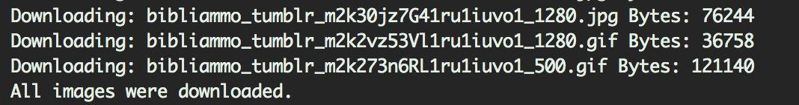

# TumblrDownloader
Download all imagens from a Tumblr, in highest resolution

## Screenshots




## Requirements

* [Python](https://www.python.org)

## Command line syntax

```bash
python tumblrdownloader.py -s <subdomain> -t <chunck> -o <output_folder>
```
Tumblr: http://bibliammo.tumblr.com/

###Example 1
```bash
 tumblrdownloader.py -s bibliammo
```
###Example 2
```bash
 tumblrdownloader.py -s bibliammo -c 10
```
###Example 3
```bash
 tumblrdownloader.py -s bibliammo -o allimages
```

## Find a bug/issue or simply want to request a new feature?

[Create a Github issue/feature request!](https://github.com/DiSiqueira/TumblrDownloader/issues/new)

## Upcoming features

* Asynchronous downloads
* Resume download
* Limit total downloads
* Resolution selector