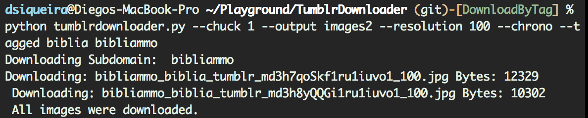

# TumblrDownloader
Download all imagens from a Tumblr

## Screenshots



## Requirements

* [Python](https://www.python.org)

## Usage

```bash
tumblrdownloader.py [-h] [--chunk CHUNK] [--total TOTAL]
                    [--start START] [--output OUTPUT]
                    [--resolution {1280,500,400,250,100,75}]
                    [--tagged TAGGED] [--chrono] [--threads THREADS]
                    subdomain

Download all images from a Tumblr

positional arguments:
  subdomain             Tumblr subdomain you want to download

optional arguments:
  -h, --help            show this help message and exit
  --chunk CHUNK         The number of posts to return each call to Tumblrs API. The default is 20, and the maximum is 50.
  --total TOTAL         Total images to download
  --start START         The post offset to start from. The default is 0.
  --output OUTPUT       Output folder
  --resolution {1280,500,400,250,100,75}
                        Select Max Width to download. The default is 1280.
  --tagged TAGGED       Download only images with tag
  --chrono              Sort in chronological order (oldest first)
  --threads THREADS     Number of parallel downloads. The default is 5.
```
Tumblr: http://{subdomain}.tumblr.com

###Example 1
```bash
 python tumblrdownloader.py subdomain
```
###Example 2
```bash
 python tumblrdownloader.py --chunk 10 subdomain
```
###Example 3
```bash
 python tumblrdownloader.py --output images2 subdomain
```
###Example 4 
```bash
 python tumblrdownloader.py --chunk 1 --output images2 --resolution 100 --chrono --tagged sunday subdomain
```

## Find a bug/issue or simply want to request a new feature?

[Create a Github issue/feature request!](https://github.com/DiSiqueira/TumblrDownloader/issues/new)


## License

The MIT License (MIT)

Copyright (c) 2013-2015 Diego Siqueira

Permission is hereby granted, free of charge, to any person obtaining a copy
of this software and associated documentation files (the "Software"), to deal
in the Software without restriction, including without limitation the rights
to use, copy, modify, merge, publish, distribute, sublicense, and/or sell
copies of the Software, and to permit persons to whom the Software is
furnished to do so, subject to the following conditions:

The above copyright notice and this permission notice shall be included in
all copies or substantial portions of the Software.

THE SOFTWARE IS PROVIDED "AS IS", WITHOUT WARRANTY OF ANY KIND, EXPRESS OR
IMPLIED, INCLUDING BUT NOT LIMITED TO THE WARRANTIES OF MERCHANTABILITY,
FITNESS FOR A PARTICULAR PURPOSE AND NONINFRINGEMENT.  IN NO EVENT SHALL THE
AUTHORS OR COPYRIGHT HOLDERS BE LIABLE FOR ANY CLAIM, DAMAGES OR OTHER
LIABILITY, WHETHER IN AN ACTION OF CONTRACT, TORT OR OTHERWISE, ARISING FROM,
OUT OF OR IN CONNECTION WITH THE SOFTWARE OR THE USE OR OTHER DEALINGS IN
THE SOFTWARE.
